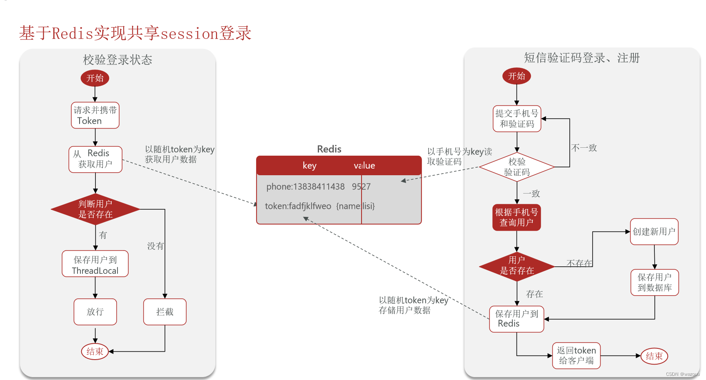
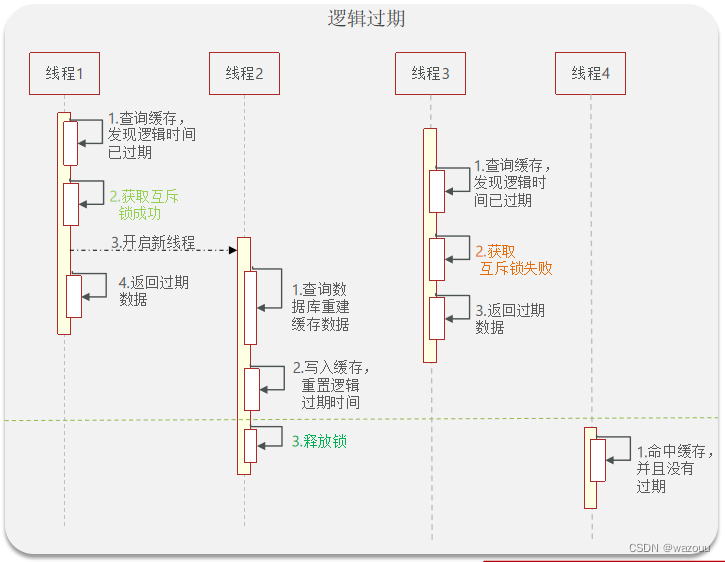
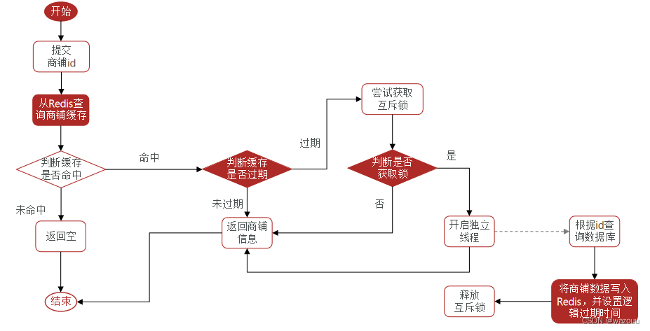
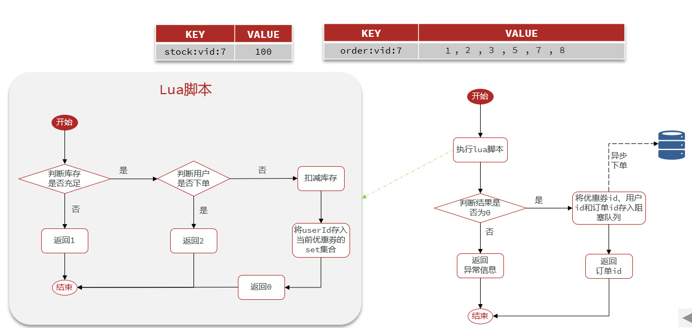

# Description

## 项目简介

本项目是一款仿大众点评的生活服务平台，完成短信验证码登录、查找点评、秒杀优惠劵、发表点评到关注推送的完整业务流程。

## 工作内容

- 基于 **Cache Aside** 模式，在更新数据库后主动删除缓存，解决数据库和缓存之间的一致性问题
- 对热点商户信息，使用**互斥锁**机制，防止缓存失效瞬间大量请求击穿数据库
- 应用 **Redis原子操作**和 **Lua 脚本**解决多条命令原子性问题，结合乐观锁实现高并发场景下优惠券秒杀的“库存扣减 + 并发校验”流程
- 使用基于 **Redisson** 的**分布式锁**实现“一人一单”校验，防止用户重复下单导致超卖
- 将扣减库存、生成订单等核心耗时操作通过 **RabbitMQ** 进行异步处理，缩短请求响应时间

## 关于项目细节和场景问题的总结

### 对于手机号登录功能的实现

单体项目考虑基于 **Session** 登录

- 用户输入手机号，点击发送验证码。服务端收到请求后，校验手机号是否符合格式，然后生成验证码。保存验证码到**Session**中，最后把验证码发送到客户端。
- 客户端根据收到的验证码，填入验证码并且点击登录按钮。服务端收到请求后，从**Session**中校验**验证码**和手机号是否符合。
如果符合，继续向下查询**数据库**中用户是否存在。
如果存在，将用户信息保存到**Session**中，并返回SessionId给客户端。客户端将之保存到Cookie中，后续请求都带着这个Cookie在请求头中。
如果数据库里面不存在用户，则新增用户。

以上方式的缺点：在**Web服务器集群的环境下**，由于Session是保存到内存中的，可能不同服务器之间有的有，有的没有。每次客户请求会发送到不同的服务器，造成用户的**多次重复登录**，影响用户使用体验。

由此，我们在集群中，应当使用 **Redis** 去实现**短信登录**

### 如何处理 Redis 缓存问题

本项目中，缓存更新采用了 **Cache Aside** 方案。也就是说，读的时候先读缓存，未命中则去**数据库**中读，并且更新至Redis中；如果是写，则先写数据库，再删除缓存。

针对缓存可能存在的问题，采取的解决方案：

#### 缓存穿透

A：**缓存空对象**

B：**布隆过滤器**解决

所谓的**布隆过滤器**，实际上是利用**位图数组**，通过Hash函数计算Hash值，并将位图中对应位置1

#### 缓存击穿

1. 采用逻辑过期解决方案
逻辑过期解决方案，需要进行数据预热，并将**热点数据**加载到Redis缓存中去。

2. 采用互斥锁

上述两种方案各有利弊，逻辑过期保证了**高可用性**，但是**数据同步无法做到强一致性**；互斥锁方案能保证数据的强一致性，但是性能不高。

### 如何解决超卖问题？

通过**乐观锁**的方式，有**版本号**法和**CAS**方法。
实际采用的是**CAS**方法，通过**自旋锁**的方式，操作共享变量。

### 一人一单问题的解决方案

在单体项目查询订单的过程中，可以通过**版本号法**和**悲观锁法**来解决该问题：

通过**Redis**的**SETNX**命令实现分布式锁（或者**zookeeper**实现分布式锁）：

对于分布式锁**SETNX**的优化过程：

- 设置value时，设置成和当前线程id相关；这样释放锁时，判断锁是否属于当前线程。如果是，则释放，反之不释放。
- 可能会出现这种情况：当前线程准备删除锁（**此时已经判定锁属于当前线程**）。但是，此时线程**发生阻塞**，锁超时释放，其他线程获取到锁并执行。
这时，漏洞出现：第一个线程阻塞结束，释放了不属于自身的锁。从而导致另外的线程也可以继续获取到锁，从而导致了**超卖**。
对于这个问题如何解决呢？我们需要采用**lua脚本**去保证**原子性**

- 但是上面这种采用了**Redis SETNX + lua脚本**的方式仍然未能实现**可重入**机制、重试机制、超时释放、主从一致性问题。那么，我们需要采用**Redisson**去解决该问题。

### 关于异步优化秒杀问题

我们可以采用异步执行的方式，去优化整个流程。也就是说，通过开启新的线程，去执行比较**耗时**的操作

注意到，**Redis**的**Stream**流支持**消费者组**，之所以要改用消费者组，是因为如果使用**单消费方式**，容易发生**消息堆积**，从而使得**消息丢失**。

- **消费者组**（Consumer Group）：将多个消息划分到一个组中，监听同一队列
- 消费者组的特点：
  - 消息分流：队列中的消息分流给组内的**不同消费者**，而不是重复消费
  - 消息标识：消费者组会维护一个标记，标记最后一个被处理的消息。为什么要这么操作呢？是因为消费者组有**宕机重启**的风险，而标记能够让其读取正确位置之后的消息，**确保每一个消息都会被消费到**
  - 消息确认：消费者获取到消息之后，消息处于**pending**状态，并且存入一个**pending-list**中去。当将消息处理完毕之后，会通过**ACK**来**确认消息**。消息被标记位处理过后，才会从**pending-list**中移除。

Stream类型消息队列的**XREADGROUP**命令特点：

- 消息可回溯
- 可以多消费者争抢消息，加快消费速度
- 可以阻塞读取
- 没有消息漏读的风险
- 有消息确认机制，保证消息至少被消费一次

#### 关于其他消息队列

#### 关于中间件：RabbitMQ/Kafka/RocketMQ

使用消息队列的目的：

- 降低系统耦合性
- 实现任务异步
- 有效地进行流量削锋

### 设计秒杀系统的关注点

#### 高并发&高性能

- 热点数据的处理：处理**热点数据**的关键是如何操作去找到那些热点数据，然后把它们弄到 **JVM** 内存中去。对于本项目来说，直接存 **Redis** 中即可，毕竟并发量不是很高。
- 通过**消息队列**来进行流量削峰，通过验证码或者说问题校验来筛选出可能存在的脚本

#### 高可用

如果想要保证一个系统的某个组件的**高可用**，往往需要**搭建集群**来避免单点风险

比如说：**Nginx**集群、**Kafka**集群、**Redis**集群

其他的方案：限流、排队、降级、熔断

#### 一致性

减库存：下单扣减库存

> 所谓的幂等，是指：对于同一个接口的多次请求，和一次请求产生的效果相同。

接口**幂等**：分布式锁，通过加锁的方式来限制线程并发执行时，数据的一致性。
